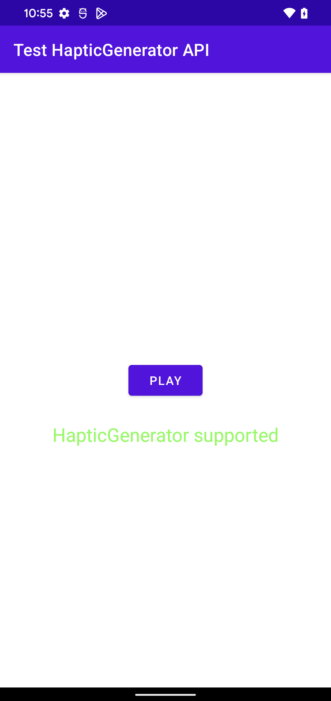

This project is a complete android app to show a problem with the HapticGenerator 
that I have fully explained [here](https://stackoverflow.com/questions/73300257/problem-with-android-12-and-the-hapticgenerator-api-audio-track-randomly-start).

Application should be compatible with Android version >= 12 (API level >=31):
HapticGenerator API is not supported by all phone models.

